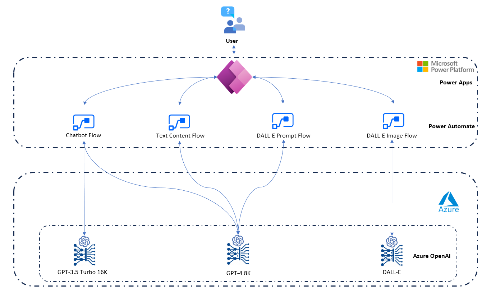
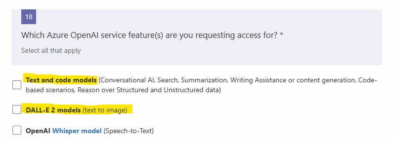
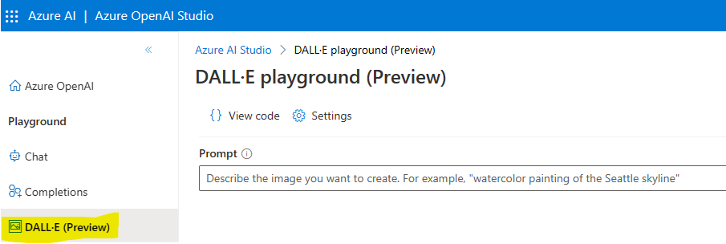

# Contoso Marketing Copilot
This PoC application demonstrates how Azure can help customer with their workflow of marketing content generation: 
1. It pre-loads (visible by clicking the magical wand) the core brand essence of Contoso Automobile (fictitious car manufactory company)
2. The user then gets to talk to a chatbot for marketing campaign ideation and consultation, who understands the brand by the loaded brand essence. The conversation can help the user to generate text based marketing material (e.g. social media posts)
3. Finally, the user can take that deliverable to the Content Studio and further refine it and enhance it with a pairing image with the help of DALL-E. 
4. Alternatively, the user can skip the chatbot conversation and directly use the content studio with/without the help of preconfigured dropdown lists to start the content generation using Azure Open AI.

All steps involved would leverage generative AI as much as possible and put human adjustment and decision in the loop. 

Now, let's see it in action:

1. [Application Demo](https://www.youtube.com/watch?v=fz2B-McXpRk&lc=UgzJ31kZwzj4lPl_NUV4AaABAg)

2. [Installation Demo](youtubeplaceholder)
## Architecture

## Let's build a Power App to use Azure Open AI ChatGPT to summarize the results from Cognitive Search

## What's needed

- [Register](https://learn.microsoft.com/en-us/azure/cognitive-services/openai/overview) for Azure Open AI. In your application [form](https://customervoice.microsoft.com/Pages/ResponsePage.aspx?id=v4j5cvGGr0GRqy180BHbR7en2Ais5pxKtso_Pz4b1_xUOFA5Qk1UWDRBMjg0WFhPMkIzTzhKQ1dWNyQlQCN0PWcu), make sure to have these 2 boxes checked: 
- Once got approved, [create an Azure OpenAI resource](https://learn.microsoft.com/en-us/azure/ai-services/openai/how-to/create-resource?pivots=web-portal) in Azure portal and select region as East US (at the time of writing, Dall-E is only available in this region)
- Create one deployment inside the resource for both GPT-4 and GPT-3.5-turbo each. 
- You should automatically be able to see the DALL-E (Preview) tab in your Azure OpenAI Studio under the Playground section 